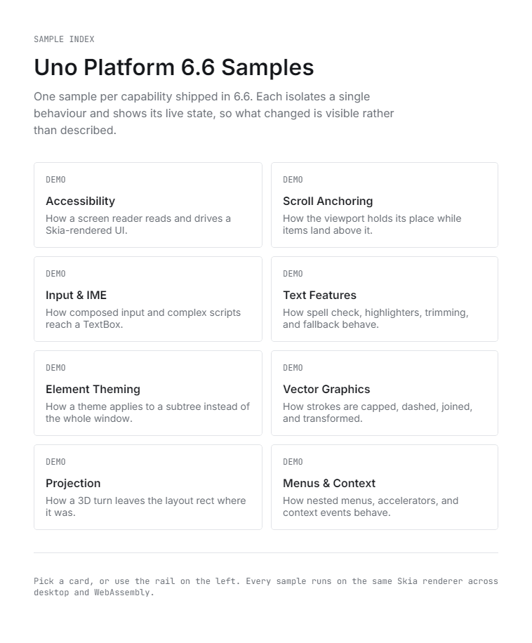

# Uno Platform 6.6 Sample Lab

A single Uno Platform app (`A11yCapture`) that demonstrates eight Uno Platform 6.6 capabilities, one section each, plus the capture scripts and release assets made from it. Each section has a source panel with trimmed XAML and C# excerpts of how it works.



## What's in it

| Path | Purpose |
|---|---|
| `A11yCapture/` | The sample app: nav rail, home index of sample cards, one section per capability, source panel |
| `A11yCapture/Presentation/Sections/` | The sections: Accessibility, Scroll anchoring, Input and IME, Text features, Element theming, Vector graphics, Projection, Menus and context |
| `A11yCapture/Presentation/SampleSource.cs` | The source excerpts shown in the source panel, keyed by section |
| `.capture/` | Screenshots, GIFs, a UIA tree dump, and PowerShell capture scripts. `ASSETS.md` tracks each asset's status; `README.md` there covers the UIA tree capture |
| `.capture/devserver-startup.md` | Measured DevServer MCP startup time, 6.5 vs 6.6 |
| `.github/workflows/deploy-pages.yml` | Publishes the WebAssembly head to GitHub Pages on push to `master` |

## Tech

- Uno Platform single project, `Uno.Sdk` 6.6.29 (`global.json`)
- Targets: `net10.0-desktop`, `net10.0-browserwasm`; Skia renderer
- `UnoFeatures` include Material, Toolkit, MVUX, Mvvm, Navigation, Hosting, Localization, ThemeService, SpellChecking
- Shell and navigation come from the Uno template (`ShellModel`, `MainModel`, `SecondPage`). The sample sections live inside `MainPage` and switch in code-behind; `InputSection` uses a small view model
- Localized strings for en, es, fr, pt-BR

## Run it

Requires the .NET 10 SDK. From the repo root:

```
dotnet run --project A11yCapture/A11yCapture.csproj -f net10.0-desktop
```

WebAssembly (as the Pages workflow builds it):

```
dotnet workload install wasm-tools
dotnet publish A11yCapture/A11yCapture.csproj -f net10.0-browserwasm -c Release -o ./publish
```

The capture scripts in `.capture/` are Windows PowerShell and expect a running desktop build; see `.capture/README.md`.

## Status

All eight sections are built and captured. `.capture/ASSETS.md` still lists the split-screen scroll anchoring GIF as not started (a `scrollanchor.gif` exists), notes that the WebGL comparison pair cannot be produced against 6.5, and the UIA tree exists as text without a tool screenshot.
